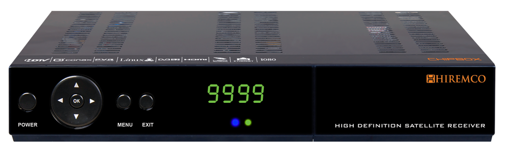

# chipbox-pars

## Getting started

Chipbox was an embedded linux DVBS2 HD satellite receiver designed & manufactured in Istanbul / Turkey between 2009-2011.



It was based on Celestialsemi CSM1203 SoC with following specs:

```
• CelestialSemi CSM1203 ARM CPU @180Mhz
• 256Mbyte DDR1 RAM
• 32Mbyte NOR Flash
• Built-in Power Supply
• Ethernet networking capabilities
• Custom minimal Linux
• DVB-S / DVB-S2 HD Set-Top-Box
• CA Card Reader
• Common Interface (CI) Slot
• SDL based UI 
• Web Interface, FTP, SSH, IPTV Streaming… many more
```

Its FW used u-boot , kernel and userspace apps.

This repository contains main UI components of Chipbox, called "**PARS**"

The repository also contains an ancient toolchain, called as **crosstool** . Sadly, this toolchain is too old ( gcc 3.4.6 - glibc 2.3.6 ) and only supports 32bit (i386)

## Code structure

```
crosstool -> toolchain ( arm-linux-gcc/g++)
mvapp -> main userspace UI app (uses minigui)
mvapi -> userspace IPC ( InterProcess Call ) library
csapi -> CelestialSemi SDK api to use various peripherals ( such as demux, hdmi, tvout...etc)
oscam -> cardsharing app ( communicates with Mvapp via mvapi )
open_sources -> various open source programs used by the system
```

## Building

Since crostool needed a 32bit environment, I created a docker container to run it: ```chipbox-docker-builder```

In order to build all -> just run ```./ba```

In order to clean all -> just run ```./ca```

## Running

Chipbox has a built-in FTP server. You can upload/download files to/from it. 

Just opload your resultant binaries ( such as mvapp.elf / oscam-chipbox ...etc) to relevant dirs and reboot the device !


